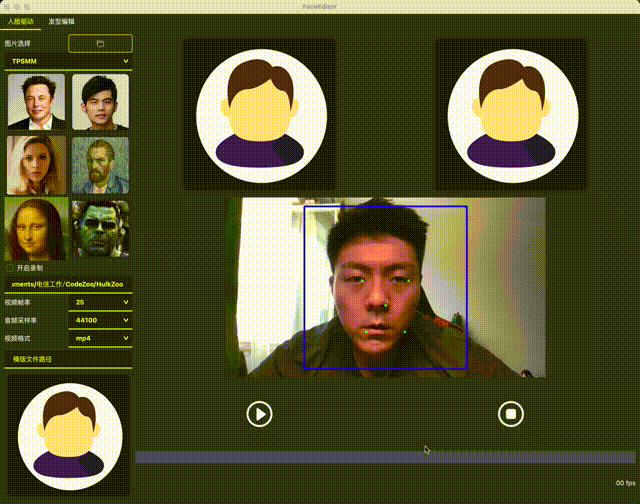

# Image Animation Turbo Boost

Aim to accelerate the image-animation-model inference through the inference frameworks such as onnx、tensorrt and openvino.

### FOMM Demo




****

## FOMM

The model using from [FOMM](https://github.com/AliaksandrSiarohin/first-order-model)

### Convert

* Convert to onnx:

```
python export_onnx.py --output-name-kp kp_detector.onnx --output-name-fomm fomm.onnx --config config/vox-adv-256.yaml --ckpt ./checkpoints/vox-adv-cpk.pth.tar
```

* Convert to trt:

dev environment: `docker pull chaoyiyuan/tensorrt8:latest`

Run:
```
onnx2trt fomm.onnx -o fomm.trt
```

### Demo

* [Python Demo](./FOMM/demo/TRT)

****

## TPSMM

The model using from [TPSMM](https://github.com/yoyo-nb/Thin-Plate-Spline-Motion-Model)

### Convert

* Convert to onnx:

```
python export_onnx.py --output-name-kp kp_detector.onnx --output-name-tpsmm tpsmm.onnx --config config/vox-256.yaml --ckpt ./checkpoints/vox.pth.tar
```

* Convert to openvino:

dev environment: `docker pull openvino/ubuntu18_dev:2021.4.2_src`

```
python3 mo.py --input_model ./tpsmm.onnx  --output_dir ./openvino --data_type FP32
```

### Demo

#### ONNXRuntime

* [Python Demo](./TPSMM/demo/ONNXRuntime/python)
* [C++ Demo](./FOMM/demo/ONNXRuntime/cpp)

To test python demo run:
```
python demo/ONNXRuntime/python/demo.py --source ../assets/source.png --driving ../assets/driving.mp4 --onnx-file-tpsmm tpsmm.onnx --onnx-file-kp kp_detector.onnx
```

To test c++ demo run:

* build
```
mkdir build && cd build
cmake ..
make -j8
./onnx_demo xxx/tpsmm.onnx xxx/kp_detector.onnx xxx/source.png xxx/driving.mp4 ./generated_onnx.mp4
```

#### OpenVINO

* [Python Demo](./TPSMM/demo/OpenVINO/python)
* [C++ Demo](./FOMM/demo/OpenVINO/cpp)

To test python demo run:
```
python demo/OpenVINO/python/demo.py --source ../assets/source.png --driving ../assets/driving.mp4 --xml-kp xxxx/kp_detector_sim.xml --xml-tpsmm xxx/tpsmm_sim.xml --bin-kp xxx/kp_detector_sim.bin --bin-tpsmm xxx/tpsmm_sim.bin
```

To test c++ demo run:

* build
```
mkdir build && cd build
cmake ..
make -j8
./openvino_demo xxx/tpsmm.xml xxx/tpsmm.bin xxx/kp_detector.xml xxx/kp_detector.bin xxx/source.png xxx/driving.mp4 ./generated_onnx.mp4
```

#### Result

|  FrameWork   | Elapsed(s)  | Language |
|  ----  | ----  | ----  |
| pytorch  | 6 | python |
| ONNXRuntime  | ~1.2 | python |
| ONNXRuntime  | ~1.6 | c++ |
| OpenVINO  | ~0.6 | python |
| OpenVINO  | ~0.6 | c++ |

>  ONNXRuntime C++ is slower compared with python, maybe related to libraries which compiled by myself.


#### To Do

Failed to convert to tensorrt, maybe scatter ops is not supported. This will be fixed in 8.4GA, according to [issues](https://github.com/NVIDIA/TensorRT/issues/1541)


### Pretrained Models

Please download the pre-trained models from the following links.
| Path | Description
| :--- | :----------
|[FOMM](https://github.com/AliaksandrSiarohin/first-order-model)  | Original Pretrained Pytorch Model.
|[TPSMM](https://github.com/yoyo-nb/Thin-Plate-Spline-Motion-Model)  | Original Pretrained Pytorch Model.
|[FOMM Onnx](https://drive.google.com/drive/folders/1CFY8XW9g2EuEbdlwjQOauDlFOefqjwJd?usp=sharing)  | onnx model of fomm.
|[FOMM TensorRT](https://drive.google.com/drive/folders/1LiDw7EbylouwXAdDrSjCMMYgERCl4Qps?usp=sharing)  | trt model of fomm.
|[TPSMM Onnx](https://drive.google.com/drive/folders/16aF7LUWt1QIzmmlqn0ZNi3ytnw28rKwP?usp=sharing)  | onnx model of tpsmm.
|[TPSMM OpenVINO](https://drive.google.com/drive/folders/1VvTzsAg4hsXVMu7b5ijFzbw23mhj6oJK?usp=sharing)  | openvino model of tpsmm.


# Acknowledgments

FOMM is [AliaksandrSiarohin](https://github.com/AliaksandrSiarohin/first-order-model)'s work.
TPSMM is [yoyo-nb](https://github.com/yoyo-nb/Thin-Plate-Spline-Motion-Model)'s work.
Thanks for the excellent works!

My work is to modify part of the network，and enable the model can be converted to onnx、openvino or tensorrt.


